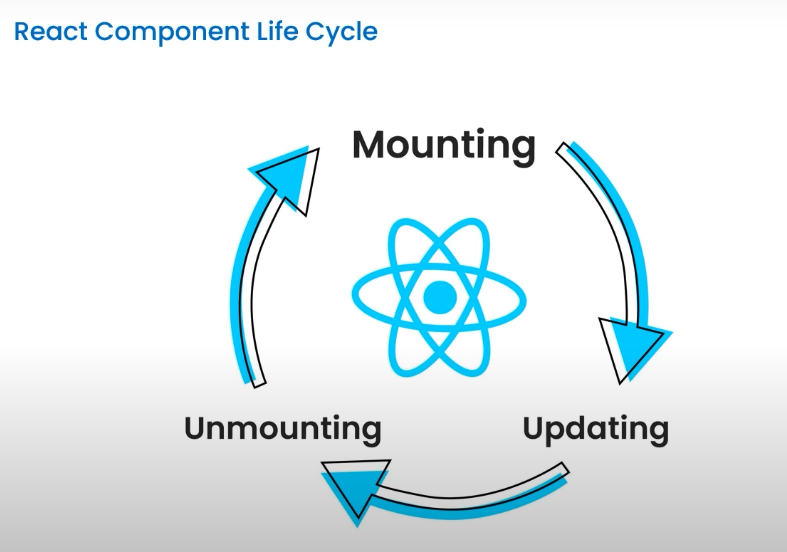
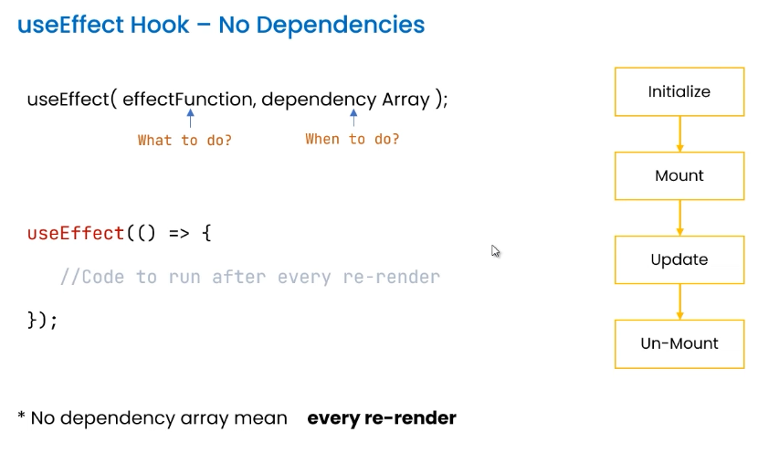

# Introduction to useEffect

`Definition:` useEffect is a React Hook used for handling side effects in functional components.

UseEffect Hook accepts two argument the first is a function contain your logic and the second is a dependency array that determines when to re-run the effect.

- Code to run after every re-render
- On Mount Only
- Dependency-based Execution

